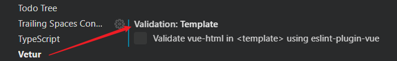

# Vue 3 Problems and Solutions

## VS Code 报错 `The template root requires exactly one element.eslint-plugin-vue`(模板根目录只需要一个元素)

在 Vue 3.x 中，Vue template 根元素结构中**开始允许有多个元素**。比如像这样

```vue
<template>
  <div class="hello">
    <h1>{{ msg }}</h1>
  </div>
  <div class="hello1">
    <h1>{{ msg }}</h1>
  </div>
</template>
```
这在 Vue 3 之前是不允许的，不光是 ESLint 报错，还会编译报错。

但现在是能正常编译输出到 Web 页面上。

可在 VS Code 编辑器中却标红报错，提示内容大致如下：

```
The template root requires exactly one element.eslint-plugin-vue
```

开始着手解决：

根据提示内容，认为是 ESLint 还未跟上 Vue 3 ，没能做出相关的配置适配。经过搜索相关资料，发现 ESLint 已对 Vue 3 做了相关的规则适配。并在 vuejs/eslint-plugin-vue Pull 记录评论区中找到解决方案：[传送门](https://github.com/vuejs/eslint-plugin-vue/pull/1188#issuecomment-658239081)。

问题出在了一个名为 **Vetur** 的 VS Code 插件上。Vetur 是一个关于 Vue 的插件，提供
- Syntax-highlighting
- Snippet
- Emmet
- Linting / Error Checking
- Formatting
- Auto Completion
- Component Data: auto-completion and
- hover-information for popular Vue frameworks and your own custom components
- Experimental Interpolation Features: auto-completion, hover information and type-checking in Vue template
- VTI: Surface template type-checking errors on CLI

问题就是出在这个 [Linting](https://vuejs.github.io/vetur/linting-error.html#linting) 上



去掉该处的勾选即可，编辑器不再会报错。

但我后面又再反复尝试验证 “Vetur template validation 的是否关闭，带来的影响”，发现打开，也不再报错了……

这就让我纳闷了，难道刚刚插件在后台更新了？修复了问题？于是我跑去看 Vetur 的更新日志

原来插件在 最近两次更新（0.26.0、0.26.1）中就修复了该问题，为不同的 Vue 版本提供不同的规则集，或者官方默认直接关掉了 Vetur template validation，直接使用 ESLint 的规则（前提是已安装了 ESLint ）：

> Vetur bundles eslint-plugin-vue for template error checking. By default, Vetur loads the vue/essential ruleset for Vue 2 projects and vue3-essential ruleset for Vue 3 projects.
>
> If you want to config ESLint rules, do the following:
>
> Turn off Vetur's template validation with vetur.validation.template: false
> Make sure you have the ESLint plugin. The errors will come from ESLint plugin, not Vetur.
> yarn add -D eslint eslint-plugin-vue in your workspace root
> ……

搞半天 Vetur 在新版本中早就解决了这问题！

可能是最近我的 VS Code 没咋打开， Vetur 没能自动“即时”更新，以至于我今天机缘巧合地稍稍深度了解下一些新的东西。说起来也不算白忙活一场。